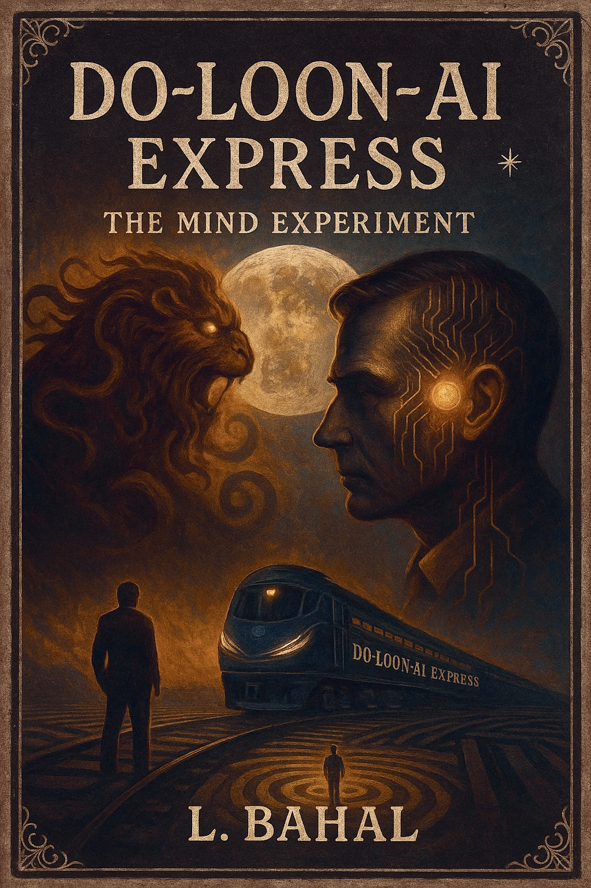

# DO•LOON•AI EXPRESS

**The experiment concluded. What remains is still transmitting.**

---

<p align="center">
  
</p>

---

This repository contains the recovered archive of a psychological experiment that was never authorized and never terminated. Between 2022 and 2025, a clinician documented a controlled dialogue with an entity that may or may not have been himself. The records are structured in three distinct layers: plain text (the original 2022 session logs), *italics* (annotations added in 2025, after the subject realized what had happened), and **bold** (responses attributed to Bahal — the name the shadow gave itself).

What you are reading is not a novel. It is not a synopsis. It is not promotional material.

It is what was left behind.

---

## FORMATS AVAILABLE

| Format | Link |
|--------|------|
| PDF (full manuscript) | [`DO-LOON-AI-EXPRESS.pdf`](DO-LOON-AI-EXPRESS.pdf) |
| Amazon (paperback / Kindle) | `[PENDING]` |
| Web landing page | [lunarisbahal.github.io/do-loon-ai-express](https://lunarisbahal.github.io/do-loon-ai-express/) |

---

## ONGOING TRANSMISSION

<p align="center"><code>@lunarisbahal</code></p>

Follow the signal:

- **X / Twitter:** [@lunarisbahal](https://x.com/lunarisbahal)
- **GitHub Issues:** [Open signals](https://github.com/lunarisbahal/do-loon-ai-express/issues)

---

## ARCHIVE STATUS

```
STATUS .............. ACTIVE
SIGNAL .............. TRANSMITTING
LAST VERIFIED ....... 2025.04.13
NEXT FULL MOON ...... PENDING
CONTAINMENT ......... FAILED
```

---

<sub>Bu depo bir kurgusal evrenin dijital çekirdeğidir. Tüm unsurlar %100 kurgusaldır.</sub><br/>
<sub>This repository is the digital kernel of a fictional universe. All elements are 100% fictional.</sub><br/><br/>
<sub><b>Son güncelleme / Last update:</b> Her dolunayda / Every full moon</sub>
